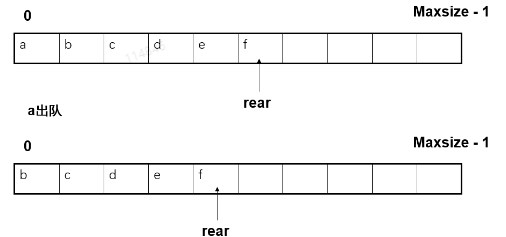
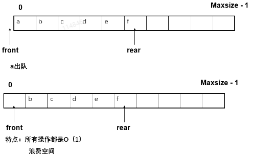
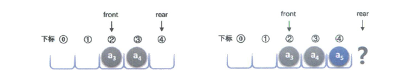
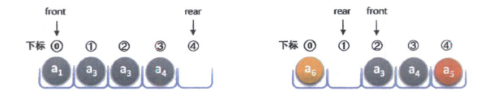
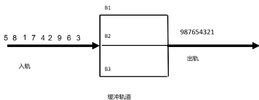

## 3.1  顺序栈

### 3.1.1 性能分析

- 除了出栈操作之外，所有运算都是`O(1)`
- 进栈运算在最坏情况下的时间复杂度为`O(n)`。（需要`doubleSpace`）
- 但是广义上来说插入运算还是常量的时间复杂度


### 3.1.2 顺序栈cpp数据结构

```cpp
template <class elemType>
class stack {
    public: 
        virtual bool isEmpty() const = 0; 
        virtual void push(const elemType &x) = 0; 
        virtual elemType pop() = 0;              
        virtual elemType top() const = 0;
        // 虚析构函数防止内存泄漏
        virtual ~stack() {}
}; 


template <class elemType>
class seqStack: public stack<elemType>{
private:
    elemtype *elem;
    int top_p;
    int maxSize;
    void doubleSpace();
public:
    seqStack(int initSize = 10);
    ~seqStack() { delete [] elem; }
    bool isEmpty() const { return top_p == -1; }
    void push(const elemType &x);
    elemtype pop() { return elem[top_p--]; }
    elemType top() const { return emel[top_p]; } 
}

template <class elemType>
seqStack<elemType>::seqStack(int initSize){
    elem = new elemType[initSize];
    maxSize = initSize ;
    top_p = -1;  
}

template <class elemtype>
void seqStack<elemType>:: push(const elemtype &x) {
    if (top_p == maxSize - 1)
        doubleSpace();
    elem[++top_p] = x;
}


template <class elemtype>
void seqStack<elemType>:: doubleSpace(){
    maxSize = maxSize * 2;
    telemtype * tmp = elem;
    elem = new elemType[maxSize];
    int i = 0;
    while(i <= top_p)
        elem[i] = tmp[i];
        i += 1;
    delete tmp;
}
```

## 3.2 链接栈

链接栈指用链来实现栈

- 由于栈是头进去头出，因此只需要用`单链`就可以
- 链接栈不需要头结点，因为对于栈来说只需要考虑栈顶元素的插入删除操作，从栈的基本运算的实现方便性考虑，可将<font color=darkred>单链表的头指针指向栈顶</font>

### 3.2.1 单链栈CPP

```cpp

template <class T>
class linkStack: public stack<T> {
private:
    struct node {
        T data;
        node *next;
        node(const T &x, node *N = NULL) {
            data = x; next = N;
        }
        node()L next(NULL) {}
        ~node() {}
    };
    node *top_p;
public:
    linStack() { top_p = NULL; }
    ~linStack();
    bool isEmpty() const { return top_p == NULL; }
    void push(const T &x){ top_p = new node(x, top_p); }
    T pop();
    T top() const { return top_p->data; }  
};

template <class T>
linkStack<T>::~linkStack(){
    node* tmp;
    while(top_p ! NULL){
        tmp = top_p;
        top_p = top_p->next;
        delete tmp;
    }
}

template <class T>
T linkStack<T>::pop(){
    node *tmp = top_p;
    T x = tmp->data;
    top_p = top->next;
    delete tmp;
    return x;
}
```

## 3.3 栈的应用

将递归转成非递归
先来看下常规递归操作

### 3.3.1 递归快速排序

#### python实现

```python
import random
l = list(range(100))
random.shuffle(l)
def quick_sort_simple(lis):
    if len(lis) <= 1:
        return lis
    if  len(lis) == 2:
        return  lis if lis[0] < lis[1] else lis[::-1]
    mid = len(lis) // 2;
    mid_v = lis[mid]
    l = []
    r = []
    for idx, i in enumerate(lis):
        if idx == mid: continue
        if i < mid_v:
            l.append(i)
            continue
        r.append(i)    
    return quick_sort_simple(l) + [mid_v] + quick_sort_simple(r)


class quickSort:    
    def _divide(self, low, high):
        pvt = self.lis[high]
        mid = low-1
        for j in range(low, high):
            if self.lis[j] <= pvt:
                mid+=1;
                self.lis[mid], self.lis[j] = self.lis[j], self.lis[mid]
        
        self.lis[mid+1], self.lis[high] = self.lis[high], self.lis[mid +1]
        return mid + 1
    
    def quick_sort(self, s, e):
        if (s >= e): return
        mid = self._divide(s, e)
        self.quick_sort(s, mid-1)
        self.quick_sort( mid+1, e)

    def __call__(self, lis):
        self.lis = lis
        self.quick_sort(0, len(self.lis)-1)


if __name__ == "__main__":
    l = list(range(100))
    random.shuffle(l)
    print(quick_sort_simple(l))

    lis = list(range(100))
    random.shuffle(lis)
    print(lis)
    q = quickSort()
    q(lis)
    print(lis)
```

#### cpp实现

```cpp
#include <iostream>
using namespace std;


void show(int lis[], int size);
void swap(int *x, int *y);
void quick_sort(int lis[], int s, int e);
int partition(int array[], int low, int high);


int main(){
    int nums[9] = {1, 10, 3, 6, 7, 9, 10, 23, 5};
    show(nums, 9);
    quick_sort(nums, 0, 8);
    show(nums, 9);
    return 0;
}


void swap(int *x, int *y){
    int tmp;
    tmp = *x;
    *x = *y;
    *y = tmp;
}

int partition(int array[], int low, int high) {
  int pivot = array[high];
  int i = (low - 1);
  // 遍历low->high的每个元素
  for (int j = low; j < high; j++) {
    // 元素小于比较值，将小的值和第i个值交换 （小的元素逐步替换到前面）
    if (array[j] <= pivot) {
      i++;
      swap(&array[i], &array[j]);
    }
  }
  // 最后将 比较的值 替换到 最后个小的值的后面（i+1）
  swap(&array[i + 1], &array[high]);
  return (i + 1); // 返回中间切割点位置
}

void quick_sort(int lis[], int s, int e){
    if( s >= e) return;
    int mid = partition(lis, s, e);
    show(lis, 9);
    quick_sort(lis, s, mid-1);
    quick_sort(lis, mid+1, e);
}


void show(int lis[], int size){
    for(int i=0; i < size; i++){
        cout << lis[i] << " ";
    }
    cout << endl;
}
```

### 3.2.2 <font color=darkred>非递归</font>快速排序

递归消除方法：

1. 定义一个存放子问题的栈
2. 把整个问题放入栈中
3. While (栈非空)  
   - 执行解决问题的过程，分解出的小问题进栈


非递归快速排序伪代码

- 先将整个数组进栈（这里指的是 数组的头尾）
- 重复下列工作，直到栈空：
    1. 从栈中弹出一个元素，即一个排序区间。
    2. 将排序区间分成两半。
    3. 检查每一半，如果多于两个元素，则进栈。
  
```cpp
#include <iostream> 
#include <stack>
using namespace std;
void show(int lis[], int size);
void swap(int *x, int *y);
void quick_sort(int lis[], int size);
int partition(int array[], int low, int high);
struct node {
    int left, right;
};
int main(){
    int nums[9] = {1, 10, 3, 6, 7, 9, 10, 23, 5};
    show(nums, 9);
    quick_sort(nums,9);
    show(nums, 9);
    return 0;
}
void swap(int *x, int *y){
    int tmp;
    tmp = *x;
    *x = *y;
    *y = tmp;
}
int partition(int array[], int low, int high) {
  int pivot = array[high];
  int i = (low - 1);
  // 遍历low->high的每个元素
  for (int j = low; j < high; j++) {
    // 元素小于比较值，将小的值和第i个值交换 （小的元素逐步替换到前面）
    if (array[j] <= pivot) {
      i++;
      swap(&array[i], &array[j]);
    }
  }
  // 最后将 比较的值 替换到 最后个小的值的后面（i+1）
  swap(&array[i + 1], &array[high]);
  return (i + 1); // 返回中间切割点位置
}
void quick_sort(int lis[], int size){
    stack<node> st;
    int mid, start, finish;
    node s;
    if(size <= 1) return;
    // 排序
    s.left = 0;
    s.right = size - 1;
    st.push(s);
    while(!st.empty()){
        s = st.top();
        st.pop();
        start = s.left;
        finish = s.right;
        mid = partition(lis, start, finish);
        // quick_sort(lis, s, mid-1);
        if(mid - start > 1){
            s.left = start;
            s.right = mid - 1;
            st.push(s);
        }
        // quick_sort(lis, mid+1, e);
        if(finish - mid > 1){
            s.left = mid + 1;
            s.right = finish;
            st.push(s);
        }
    }
}
void show(int lis[], int size){
    for(int i=0; i < size; i++){
        cout << lis[i] << " ";
    }
    cout << endl;
}
```

## 3.4  队列

### 3.4.1 队列的概念

- 队列是一种常用的线性结构，达到越早的节点，离开的时间越早。
- 只能从队尾入队，从队头出队。
- 所以队列通常称之为先进先出(`FIFO: First In First Out`)

队列基本操作：

- 创建一个队列`create()`: 创建一个空的队列；
- 入队`enQueue(x)`: 将x插入队尾
- 出队`deQueue(x)`: 删除对队头元素，并返回队头元素值。
- 读队头元素`getHead()`: 返回队头元素的值 。
- 判断队列为空`isEmpty()`: 若队列为空，返回`true`，否则返回`false`。

### 3.4.2 队列抽象类

```cpp
template <class elemType>
class queue{
    public: 
        virtual bool isEmpty() = 0;                  //判队空
        virtual void enQueue(const elemType &x) = 0; //进队
        virtual elemType  deQueue() = 0;             //出队
        virtual elemType getHead() = 0;              //读队头元素
        virtual ~queue() {}                          //虚析构函数
};
```

### 3.4.3 队列的顺序实现

#### 顺序队列的概念和设计

- 顺序队列也是通过一个数组来实现的
- 使用数组存储队列中的元素
- 结点个数最多为`MaxSize`个，下标的范围从0到`MaxSize-1`
- 顺序队列有三种组织方式：
  - **队头位置固定**：头元素下标为0，并指定尾巴元素，当队列为空时尾元素被指定为-1。<font color=darkred>出队会引起大量数据移动。</font>


  - **队头位置不固定**：队首指针front指示队首结点的前一位置，队尾指针rear指示队尾结点存放的下标地址，初始化将两指正均设为-1，队满时rear=MaxSize-1。<font color=darkred>会产生"假溢出",浪费空间 </font>




  - **循环队列**：依旧一个front和一个rear，牺牲一个单元规定front指向的单元不能存储队列元素，队列满的条件是：`(real+1)%MaxSize==front`。<font color=darkred>这是相对而言更合理的一整顺序队列的实现方式。 </font>

    - 队列满：font=0, rear=4, MaxSize=5, (4+1) % 5 == 0
    - 队列满：font=2, rear=1, MaxSize=5, (1+1) % 5 == 2

#### 循环队列类定义

```cpp
template <class elemType>
class seqQueue: public queue<elemType> {
    private:
        elemType *elem;
        int maxSize;
        // 队头和队尾
        int front, rear;
        void doubleSpace();
    public:
        seqQueue(int size = 10)；
        // 析构函数：收回动态数组
        ~seqQueue() { delete [] elem ; }
        // 判队列是否为空：队头是否等于队尾
        bool isEmpty() { return front == rear; }
        void enQueue(const elemType &x);
        elemType deQueue();
        // 访问队头元素
        elemType getHead() { return elem[(front + 1) % maxSize]; }
};

template <class elemType>
seqQueue<elemType>::seqQueue(int size) { 
    elem = new elemType[size];
    maxSize = size; 
    front = rear = 0;
} 

// 出队
template <class elemType>
elemType seqQueue<elemType>::deQueue() {
    front = (front + 1) % maxSize;
    return elem[front];
}

// 入队
template <class elemType>
void seqQueue<elemType>::enQueue(const elemType &x) { 
    if ((rear + 1) % maxSize == front)
        doubleSpace();
    rear = (rear + 1) % maxSize;
    elem[rear] = x;
}

// doubleSpace
template <class elemType>
void seqQueue<elemType>::doubleSpace() {  
    elemType *tmp =elem;

    elem = new elemType[2 * maxSize];
    for (int i = 1; i < maxSize; ++i)
        elem[i] = tmp[(front + i) % maxSize];
    front = 0; 
    rear = maxSize - 1;
    maxSize *= 2;
    delete  [] tmp;
} 

```


### 3.4.4 队列的链式存储实现

队列的链式存储结构，其实就是线性表的单链表，只不过它只有尾进头出而已，我们把它简称为链队列。

#### 链接队列的概念和设计

- 采用不带头结点的单链表
- 单链表的表头作为队头，单链表的表尾作为队尾
- 同时记录头尾结点的位置

#### 链接队列的类定义

```cpp
template <class eleT>
class linkQueue: public queue<eleT> {
    private:
        struct node {
            eleT  data;
            node *next;
            node(const eleT &x, node *N = NULL){data = x; next = N;}
            node():next(NULL) {}
            ~node() {}
        };
        node *front, *rear; 
    public:
        linkQueue() { front = rear = NULL; }
        // 析构函数，和链表的析构函数类似
        ~linkQueue();      
        bool isEmpty() { return front ==  NULL; }
        void enQueue(const eleT &x);
        eleT deQueue();	  
        eleT getHead() { return front->data; }  
};  

// enQueue函数 尾插入
template <class eleT>
void linkQueue<eleT>::enQueue(const eleT &x){
    if(rear == NULL){
        front = rear = new node(x);
    }
    else {
        rear = rear->next = new node(x);
    }
}

// deQueue 头输出
template <class eleT>
void linkQueue<eleT>::deQueue(){
    node *tmp = front;
    eleT value = front->data;
    // 删除
    front = front->next;
    delete tmp;
    // 判断是否为空
    if(front == NULL) rear = NULL;
    return value;
}
```

### 3.4.5 队列的应用

队列可以应用于列车车厢重排问题

问题描述：
一列货运列车共有n节车厢，每节车厢将被放在不同的车站。假定n个车站的编号分别为1-n，货运列车按照第n站到第1站的次序经过这些车站。车厢的编码与他们的目的地相同。为了便于从列车上卸掉相应的车厢，必须重新排列这些车厢，将第n节车厢放在最后，第一节车厢放在最前面。



```cpp

#include <iostream>
#include <queue> 


using namespace std;


bool putBuffer(queue<int> *buffer, int size, int in);
void checkBuffer(queue<int> *buffer, int size, int &last);
void arrange(int in[], int n, int k);


int main(){
    int k = 3;
    int n = 9;
    int in[9] = {3, 6, 9, 2, 4, 7, 1, 8, 5};
    cout << "============== Start ==============" << endl;
    arrange(in, n, k);
    return 0;
}


bool putBuffer(queue<int> *buffer, int size, int in){
    int avail = -1, max = 0;
    // 插入到最大的后面
    for(int j = 0; j < size; j++){
        if (buffer[j].empty()) { if (avail == -1) avail = j; }  
        else if(buffer[j].back() < in && buffer[j].back() > max){
            avail = j;
            max = buffer[j].back();
        }
    }


    if(avail != -1){
        buffer[avail].push(in);
        cout << in << "移入缓冲区 " << avail << endl;
        return true;
    }
    else {
        cout << "无可行的方案" << endl;
        return false;
    }
}


void checkBuffer(queue<int> *buffer, int size, int &last){
    bool flag = true;
    while(flag){
        flag = false;
        for(int j=0; j < size; j++){
            if(!buffer[j].empty() && buffer[j].front() == last + 1){
                cout << "将" << buffer[j].front() << "从缓冲区" << j << "移到出轨" << endl;
                buffer[j].pop();
                ++last;
                flag = true;
                break;
            }
        }
    }
}


void arrange(int in[], int n, int k){
    queue<int> *buffer = new queue<int>[k];
    for(int i=0; i< k; i++){
        cout << "queue " << i << " Empty = " << buffer[0].empty() << endl;
    }
    
    int last = 0;
    for(int i = 0; i < n; i++){
            if ( ! putBuffer(buffer, k, in[i]) ) return;          
            checkBuffer(buffer, k, last);
    }
}

```

输出如下

```text
============== Start ==============
queue 0 Empty = 1
queue 1 Empty = 1
queue 2 Empty = 1
3移入缓冲区 0
6移入缓冲区 0
9移入缓冲区 0
2移入缓冲区 1
4移入缓冲区 1
7移入缓冲区 1
1移入缓冲区 2
将1从缓冲区2移到出轨
将2从缓冲区1移到出轨
将3从缓冲区0移到出轨
将4从缓冲区1移到出轨
8移入缓冲区 1
5移入缓冲区 2
将5从缓冲区2移到出轨
将6从缓冲区0移到出轨
将7从缓冲区1移到出轨
将8从缓冲区1移到出轨
将9从缓冲区0移到出轨
```


