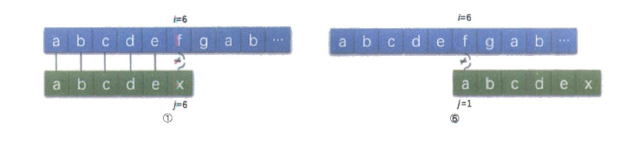
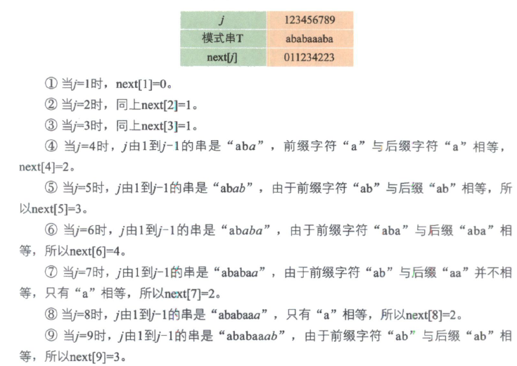

## 4.1 字符串定义

- 字符串是由零个或多个字符串组成的有限序列，一般记为`s="a0a1a2...an-1`，n为字符的长度
- 将每个ai看成一个元素，则字符串可以看成一个线性表
- 字符串的特点：需要对整个表而不是表中元素进行操作。

## 4.2 字符串操作

- 求字符串长度
- 输出字符串 disp(s)
- 判断两个字符串大小
- 字符串赋值copy(s1,s2)
- 字符串连接cat(s1, s2)
- 取子串 substr(s, statr, len)
- 字符串插入 insert(s1, start, s2)
- 删除子串 remove(s, start, len)

## 4.3 字符串存储

- 顺序存储
  - 用字符数组存储字符串
    - C语言的处理方式：固定大小的数组（可以调用cstring库，处理字符串）
    - C++的处理方式：动态改变数组大小（使用string类）
  - 缺点：插入子串，删除子串的时间性能差
-链接存储
  - 用单链表存储字符串
    - 缺点：空间问题，1个字符串1个字节，1个指针可能占4个字节
  - 用块状链表存储字符串

## 4.4 KMP模式匹配算法

D.E.Knuth、J.H.Morris和V.R.Pratt（其中Knuth和Part共同研究，Morris独立研究）发表一个模式匹配算法，可以大大避免重复遍历的情况，我们把它称之为<font color=darkred>克努特-克里斯-普拉特算法，简称KMP算法</font>。

### 4.3.1 KMP模式匹配算法的原理

KMP匹配模式算法就是为了让这没必要的回溯不发生。
既然`i`值不回溯，也就是不可以变小，那么要考虑的变化就是`j`值了。

- `j`值取决于模式串T的结构中是否有重复的问题。
- `j`的大小取决于<font color=darkred>当前字符之间的串的前后缀的相似度</font>。
  - 即，在查找字符串前，先对查找的字符串做一个分析，这样可以大大减少我们查找的难度，提高查找的速度



#### next 数组



```cpp
#include <iostream>
#include <string>

using namespace std;

void get_dp(string T, int dp[][256]);
int index_KMP(string S, string T, int pos);


int main(){
    string s = "abababcabx";
    string t = "abcabx";
    cout << "Start  match [ " <<  t << " ] in " << "[ " << s << " ]" << endl;
    int len_t = t.length();
    int res = index_KMP(s, t, 0);
    cout << res << endl;
}


// 返回子串T在主串中第pos个字符之后的位置。若不存在，则返回-1
int index_KMP(string S, string T, int pos){
    int j = pos;
    int len_S = S.length();
    int const len_T = T.length();
    int dp[len_T][256];
    int char_idx;
    get_dp(T, dp);
    for(int i = 0; i < len_S; i++){
        char_idx = S[i];
        cout << "Find " << S[i];
        cout << " next j=" << dp[j][char_idx] << endl;
        j = dp[j][char_idx];
        if( j == len_T){
            int res = i - len_T + 1;
            cout << "The string [ " <<  T << " ] in " << "[ " << S << " ]: \n";
            cout << "from " << res << " to " << i << endl;
            return res;
        }
    }
    return -1;
}


// 构建动态规划数组
void get_dp(string T, int dp[][256]){
    // dp [len_t][255]
    int len_T = T.length();
    for(int r=0; r<len_T; r++){
        fill(dp[r], dp[r]+256, 0);
    }
    int char_idx = T[0];
    dp[0][char_idx] = 1;
    cout << "T[0]= " << T[0] << " : " << char_idx  << endl;
    // same state x
    int x = 0;
    for(int j = 1; j < len_T; j++){
        char_idx = T[j];
        cout << "T[" << j << "]= " << T[j] << " : " << char_idx << endl;
        for(int c = 0; c < 256; c++){
            dp[j][c] = dp[x][c];
        }
        dp[j][char_idx] = j + 1;
        x = dp[x][char_idx];
    }
}

```

输出结果

```text
Start  match [ abcabx ] in [ abababcabx ]
T[0]= a : 97
T[1]= b : 98
T[2]= c : 99
T[3]= a : 97
T[4]= b : 98
T[5]= x : 120
Find a next j=1
Find b next j=2
Find a next j=1
Find b next j=2
Find a next j=1
Find b next j=2
Find c next j=3
Find a next j=4
Find b next j=5
Find x next j=6
The string [ abcabx ] in [ abababcabx ]:
from 4 to 9
4
```
