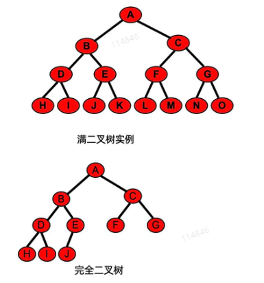
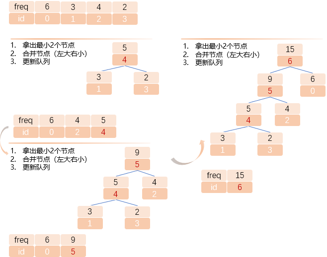

## 5.1 二叉树的概念

- 二叉树（Binary Tree）是结点的有限集合，它或者为空，或者由一个根结点及两棵互不相交的左、右子树构成，而其左、右子树有都是二叉树
  - 二叉树的左右是严格区分的，如果交换一颗二叉树的左右子树后得到的是另一颗子树

- 满二叉树
  - 一颗高度为`k`并就有$2^k-1$个结点的二叉树称为满二叉树
- 完全二叉树
  - 在满二叉树的最底层自右至左依次去掉若干结点得到的二叉树被称之为完全二叉树。
  - 特定：
    - 所有的叶子节点都出现在最低的两层上
    - 对任一节点，如果其右子树的高度为`k`，则其左子树的高度为`k`或`k+1`




## 5.2 二叉树的性质

1. 在二叉树的第`i`层至多有$2^{i-1}$个节点（$ i >= 1$）
2. 深度为`k`至多有$2^k-1$个结点
3. 对任何一颗二叉树T，如果其终端结点数为$n_0$，度为2的节点数为$n_2$，则$n_0 = n_2 + 1$
   1. 推导：节点数$n = n_0 + n_1 + n_2$  
   2. 总共连接线数$n - 1 = n_1 + n_2 * 2$ 
   3. 所以$n_0 + n_2 - 1 = 2 * n_2$  
   4. 即$n_0 = n_2 + 1$ 
4. 具有n个结点的完全二叉树的深度为$[log_2n] + 1$ 
5. 如果对一颗有n个结点的完全二叉树的结点按层序编码, 对任一结点`j`（1<=j<=n）有：
   1. 如果`j=1`, 则结点`j`是二叉树的根，如parent; 如果j>1，则parent为`[j/2]`
   2. 如果$2j>n$，则结点`j`无左孩子（结点`j`为叶子结点）；否则其左孩子结点是`2j`
   3. 如果$2j+1>n$，则结点`j`无右孩子；否则其右孩子结点是`2j+1`


## 5.3 二叉树基本操作
- 建树`create()`：创建一棵空的二叉树
- 清空`clear()`：删除二叉树中的所有结点
- 判空`IsEmpty()`：判别二叉树是否为空树
- 求树的规模`size()`：统计树上的结点数
- 找根结点`root()`：找出二叉树的根结点值；如果树是空树，则返回一个特殊值
- 找父结点`parent(x)`：找出结点x的父结点值；如果x不存在或x是根，则返回一个特殊值
- 找左孩子`lchild(x)`：找结点x的左孩子结点值；如果x不存在或x的左儿子不存在，则返回一个特殊值
- 找右孩子`rchild(x)`：找结点x的右孩子结点值；如果x不存在或x的右儿子不存在，则返回一个特殊值
- 删除左子树`delLeft(x)`：删除结点x的左子树
- 删除右子树`delRight(x)`：删除结点x的右子树
- VLR前序遍历`preOrder()`：
  - 访问根节点
  - 前序遍历左子树
  - 前序遍历右子树
- LVR中序遍历`midOrder()`：
  - 中序遍历左子树
  - 访问根节点
  - 中序遍历右子树
- LRV后序遍历`postOrder()`：
  - 后序遍历左子树
  - 后序遍历右子树
  - 访问根节点
- 层次遍历`levelOrder()`：层次遍历二叉树上的每个结点
  - 先访问根结点，然后按从左到右的次序访问第二层的结点。在访问了第k层的所有结点后，再按从左到右的次序访问第k+1层。以此类推，直到最后一层。

<font color=darkred>我们可以通过前序遍历+中序遍历确定一颗二叉树</font>：

1. 找出根结点，区分左右子树
2. 继续对左右子树重复这个过程
3. 右子树只有根结点
4. 找出左子树的前序、中序序列

## 5.4 二叉树链表类设计
也可以看笔者之前写文章[数据结构_二叉树_属性-构建-遍历(cpp & python)](https://blog.csdn.net/Scc_hy/article/details/123676940)

由于在二叉树中很少存在通过儿子找父亲的操作，所以我们常用二叉链表进行存储，二叉链表也被称作二叉树的标准存储方式。


## 5.5 哈夫曼树

   哈夫曼树是一种重要的数据结构，用于压缩和编码数据。它由经典的数学家和计算机科学家大卫哈夫曼在20世纪50年代发明。哈夫曼树的目的是为了在编码和解码数据中，尽可能地减少所需的比特数。换句话说，<font color=darkred>它可以将大量数据压缩为在传输过程中所需的最小比特数。</font>

  在NLP领域的词向量开篇制作Word2Vec中用到了一种softmax优化方法——层次softmax，就是将词频编码成哈夫曼树的形式，然后，（以skip-gram为例）在样本`[v, w]`进入模型前，将周围词`w`，基于哈夫曼树映射成从根到叶路径两个方向路径`right_path=[p1, p2]; left_path=[n1, n2]`，最终组成`[[v, p1], [v, p2]]; [[v, n1], [v, n2]`，最后以`v, p, v, n` 四个一维向量的方式进入模型。

### 5.5.1 哈夫曼树构建伪代码

哈夫曼树的构建过程非常简单，可以分为以下几个步骤：

1. 根据数据出现的频率创建叶子节点，频率越高的字母对应的节点越靠近根节点。
2. 对于两个字符的节点（由频率最低的字符所对应的节点）之间创建一个父节点。父节点的权重等于其两个子节点权重之和。
3. 重复步骤2，直到所有的节点都被合并到同一个根节点下。

#### 哈夫曼树构建图示



### 5.5.2 哈夫曼树构建python

借助优先队列`headq` 便于快速输出最小的2个节点

```python
import heapq 

class Node: 
    def __init__(self, idx, freq, char, left, right):
        self.idx = idx
        self.freq = freq
        self.char = char
        self.left = left
        self.right = right
        
    def __lt__(self, other): 
        return self.freq < other.freq 
    
    def __str__(self):
        return f'Node([{self.idx}]({self.char}/{self.freq}), left={self.left}, right={self.right})'
    
    def __repr__(self):
        return str(self)


def build_huffman_tree(data=None, freq_map=None): 
    if freq_map is None:
        freq_map = dict() 
        for char in data: 
            freq_map[char] = freq_map.get(char, 0) + 1 
    print(freq_map)
    word_map = [Node(idx, freq, char, None, None) for idx, (char, freq) in enumerate(freq_map.items())] 
    min_node = min(word_map)
    print(min_node)
    print('len(word_map)=', len(word_map))
    # 初始化 因为heappop 会先输出第一个元素
    node_heap = [min_node] + [Node(idx, freq, char, None, None) for idx, (char, freq) in enumerate(freq_map.items()) if char != min_node.char] 
    # 构建哈夫曼树
    while len(node_heap) > 1: 
        # 优先队列， 弹出最小的2个
        left_node = heapq.heappop(node_heap) 
        right_node = heapq.heappop(node_heap) 
        freq_sum = left_node.freq + right_node.freq 
        idx = len(word_map)
        # 左大右小
        combined_node = Node(idx, freq_sum, None, right_node, left_node) 
        heapq.heappush(node_heap, combined_node) 
        word_map.append(combined_node)
    # 哈夫曼树最后
    print('len(word_map)=', len(word_map))
    return node_heap[0], word_map


if __name__ == "__main__":
    test_dict = {
        'a': 6, 'b': 3,
        'c': 4, 'd': 2
    }
    huffman_tree, total_word_map = build_huffman_tree(freq_map=test_dict) 
    print(huffman_tree)

```

结果

```text
res = """
Node([6](None/15), 
     left=Node([5](None/9), 
               left=Node([4](None/5), 
                        left=Node([1](b/3), left=None, right=None), 
                        right=Node([3](d/2), left=None, right=None)
                         ), 
               right=Node([2](c/4), left=None, right=None)
               ), 
     right=Node([0](a/6), left=None, right=None)
)
"""
```

### 5.5.3 哈夫曼code & path

哈夫曼树已经构成了，哈夫曼code生成就简单了
基本思路就是： `当前节点的code = 父节点code + [当前方向code]`
用队列来做辅助：存储未处理的节点

```python

import heapq 
from collections  import deque


class Node: 
    def __init__(self, idx, freq, char, left, right):
        self.idx = idx
        self.freq = freq
        self.char = char
        self.left = left
        self.right = right
        self.code = []
        self.path = []
        
    def __lt__(self, other): 
        return self.freq < other.freq 
    
    def __str__(self):
        return f'Node([{self.idx}]({self.char}/{self.freq}), left={self.left}, right={self.right})'
    
    def __repr__(self):
        return str(self)


def build_huffman_tree(data=None, freq_map=None): 
    if freq_map is None:
        freq_map = dict() 
        for char in data: 
            freq_map[char] = freq_map.get(char, 0) + 1 
    print(freq_map)
    word_map = [Node(idx, freq, char, None, None) for idx, (char, freq) in enumerate(freq_map.items())] 
    min_node = min(word_map)
    print(min_node)
    print('len(word_map)=', len(word_map))
    # 初始化 因为heappop 会先输出第一个元素
    node_heap = [min_node] + [i for i in word_map if i.char != min_node.char] 
    # 构建哈夫曼树
    while len(node_heap) > 1: 
        # 优先队列， 弹出最小的2个
        left_node = heapq.heappop(node_heap) 
        right_node = heapq.heappop(node_heap) 
        freq_sum = left_node.freq + right_node.freq 
        idx = len(word_map)
        # 左大右小
        combined_node = Node(idx, freq_sum, None, right_node, left_node) 
        heapq.heappush(node_heap, combined_node) 
        word_map.append(combined_node)
    # 哈夫曼树最后
    print('len(word_map)=', len(word_map))
    h_tree = complete_code_path(node_heap[0])
    return h_tree, word_map


def complete_code_path(h_tree):
    help_list = deque()
    h_tree.path = [h_tree.idx]
    h_tree.code = [-1]
    help_list.append(h_tree)
    while len(help_list):
        n = help_list.popleft()
        while n.left:
            l = n.left
            r = n.right
            l.code = n.code + [1]
            r.code = n.code + [0]
            l.path = n.path + [l.idx]
            r.path = n.path + [r.idx]
            help_list.append(r)
            n = l
    return h_tree


if __name__ == '__main__':
    test_dict = {
        'a': 6, 'b': 3,
        'c': 4, 'd': 2
    }
    h_tree, total_word_map = build_huffman_tree(freq_map=test_dict) 
    for i in total_word_map:
        print('--'*25)
        print(i)
        print('code=', i.code)
        print('path=', i.path)

```

结果如下

```text
Node([3](d/2), left=None, right=None)
len(word_map)= 4
len(word_map)= 7
--------------------------------------------------
Node([0](a/6), left=None, right=None)
code= [-1, 0]
path= [6, 0]
--------------------------------------------------
Node([1](b/3), left=None, right=None)
code= [-1, 1, 1, 1]
path= [6, 5, 4, 1]
--------------------------------------------------
Node([2](c/4), left=None, right=None)
code= [-1, 1, 0]
path= [6, 5, 2]
--------------------------------------------------
Node([3](d/2), left=None, right=None)
code= [-1, 1, 1, 0]
path= [6, 5, 4, 3]
--------------------------------------------------
Node([4](None/5), left=Node([1](b/3), left=None, right=None), right=Node([3](d/2), left=None, right=None))
code= [-1, 1, 1]
path= [6, 5, 4]
--------------------------------------------------
Node([5](None/9), left=Node([4](None/5), left=Node([1](b/3), left=None, right=None), right=Node([3](d/2), left=None, right=None)), right=Node([2](c/4), left=None, right=None))
code= [-1, 1]
path= [6, 5]
--------------------------------------------------
Node([6](None/15), left=Node([5](None/9), left=Node([4](None/5), left=Node([1](b/3), left=None, right=None), right=Node([3](d/2), left=None, right=None)), right=Node([2](c/4), left=None, right=None)), right=Node([0](a/6), left=None, right=None))
code= [-1]
path= [6]
```