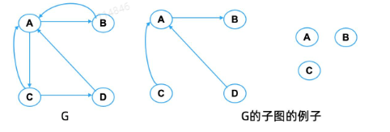
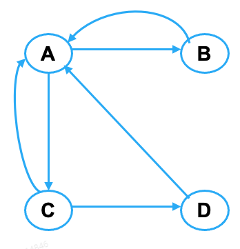
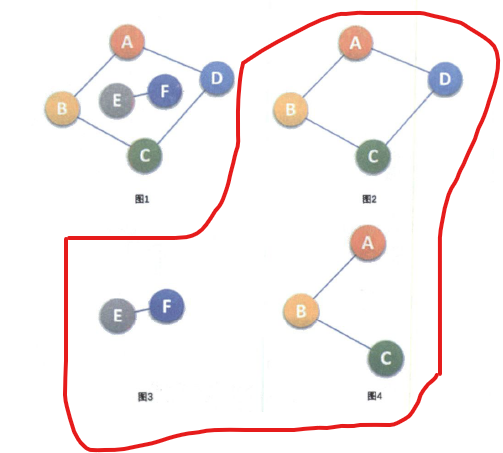
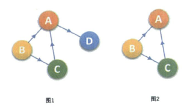
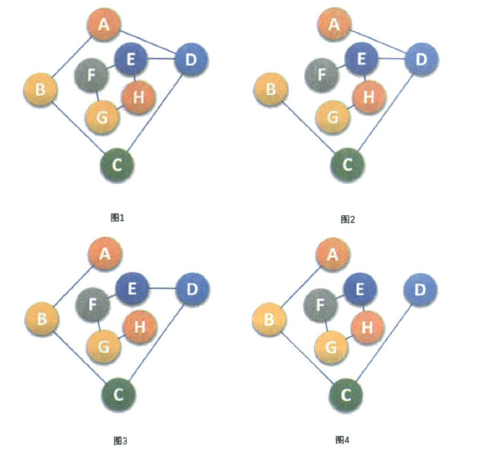
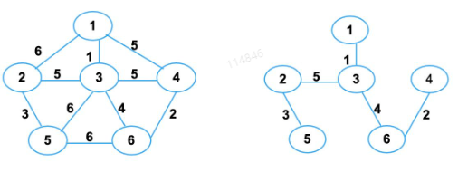
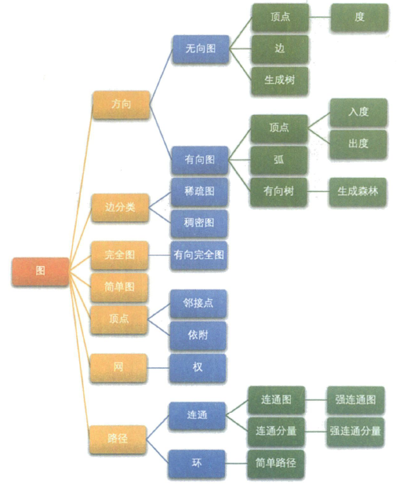
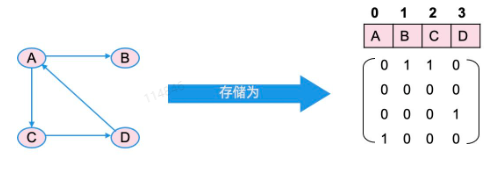
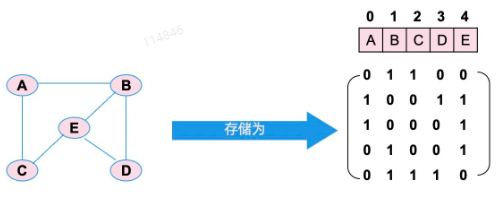
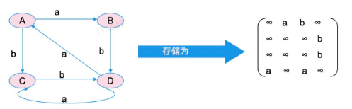

## 7.1 图的概念

图是四种逻辑结构中最复杂的结构:

- 集合结构: 其中的元素之间没有关系
- 线性结构：严格一对一关系
- 树状结构：一对多的关系
- 图状结构：多对多的关系

在数学中，图可以用$G=(V, E)$来定义，其中，`V`表示图中的顶点集，`E`表示图的边集。

- 有向图：
  - 边有方向，也称为弧
  - 边用`<>`表示，比如`<A, B>`表示`A`出发到`B`的一条边
- 无向图
  - 边无方向
  - 边用`()`表示，比如`(A, B)`表示`A`和`B`之间有一条边
- 加权图
  - 边被赋予一个权值`W`
  - 如果图是有向的，被称为加权有向图，边表示为`<A, B, W>`
  - 如果图是无向的，被称为加权无向图，边表示为`(A, B, W)`

## 7.2 图的操作与抽象类

- 基本操作
  - 构造一个由若干结点、0条边组成的图
  - 判断两个结点之间是否有边存在
  - 在图中添加或删除一条边
  - 返回图中的结点数或边数
  - 按某种规则遍历图中的所有结点
- 还有一些应用密切关联的操作
  - 拓扑排序
  - 关键路径
  - 找最小生成树
  - 找最短路径等

### 图的抽象类

```cpp
template <class TypOfVer, class TypeOfEdge>
class graph {
    public:
        virtual void insert(TypeOfVer x, TypeOfVer y, TypOfEdge w) = 0;
        virtual void remove(TypeOfVer x, TypeOfVer y) = 0;
        virtual ~graph();
        int numOfVer() const {return Vers;}
        int numOfEdge() const {return Edges;}
    
    protected:
        int Vers, Edges;
}
```

## 7.3 图的术语

1. 度： 图中连接某一节点的边的总是
   - 入度：有向图进入某一节点的边数
   - 出度：有向图离开某一节点的边数
2. 子图
   - 设有两个图 $G=(V, E)$ 和 $G'=(V', E')$ ，如果 $V' \in V, E' \in E$， 则称`G'`为`G`的子图  

3. 路径
    - 对$1<i<N$，节点序列 $W_1, W_2, ..., W_N$ 中的节点对 $(W_i, W_{i+1})$ 都有 $(W_i, W_{i+1}) \in E$ 或者  $<W_i, W_{i+1}> \in E$
    - 简单路径：如果一条路径上的所有节点，除了起始节点和终止及节点可能相同外，其他节点都不相同，比如下图 BACD 、ABA
    - 环：环是一条简答路径，其起始节点和终止节点相同，且路径长度至少为1，比如下图的ACDA 、ABA  

4. 路径长度
   - 非加权的路径长度：组成路径的边数
   - 加权路径长度：路径上所有边的权值之和
5. 连通性
   - 无向图：
     - 连通：两顶点间存在路径
     - 连通图：任意两点之间都是连通的无向图
     - 连通分量：非连通图中的极大连通子图。图1是一个无向非连通图。但是他有两个连通分量，即图2和图3。而图4，尽管是图1的子图。但是不满足连通子图的极大顶点数。因此不是图1的无向图的分量。  

   - 有向图：
     - 强连通：两顶点间存在路径
     - 强连通分量：非强连通图中的极大连通子图。下图1并不是强连通图，因为顶点A到顶点D存在路径，而D到A不存在路径。图2为强连通图，而且显然图2是图1的极大强连通子图，即它的强连通分量
     - 弱连通图：如果有向图G不是强连通的，但是如果把它看成无向图是连通。  

6. 完全图
    - 无向完全图：任意俩节点之间都有边的无向图
    - 有向完全图：任意俩节点之间都有弧的有向图  
7. 生成树：连通图的极小连通子图
    - 包含图的所有n个节点和n-1条边 （图2，图3为图1的生成树；有n-1条边不一定是生成树，如图4）
    - 在生成树中添加一条边后，必定会形成回路或环  

8. 最小生成树
    - 加权无向图的所有生成树中边的权值之和最小的生成树。  


### 图的数据总结




## 7.4 图的存储

### 7.4.1 邻接矩阵

邻接矩阵的概念及设计

#### 有向图

- V集合存储在一个数组中
- E集合用n行n列的布尔矩阵A表示
  - 如果i -> j有边则 `A[i, j] = 1`, 否则`A[i, j] = 0`
- 特点：
  - 第i**行**之和，为第i个节点的**出度**
  - 第j**列**之和，为第j个节点的**入度**



#### 无向图

- V 集合存储在一个数组中
- E集合用n行n列的布尔矩阵A表示
  - 如果i 与 j有边则 `A[i, j] = 1` 及 `A[j, i] = 1`
- 特点：
  - 是一个对称矩阵
  - 节点i的度是 i行或j列之和
  


#### 加权图

- 如果i->j有一边且权值为a，则 `A[i, j] = a`
- 若无边，则 `A[i, j] = 空或其他标志`


- 性能分析
  - 优点：基本操作都是`O(1)`的时间复杂度，不仅能找到出发的边，也能找到到达的边
  - 缺点：即使$<<n^2$ 条边，也需要$n^2$个单元，而大多数的图的边数远远小于$n^2$




### 7.4.2 邻接接表

邻接表的概念及设计

- 邻接表是图的标准存储方式
  - V 集合
    - 用**数组或单链表**的形式存放所有的节点值
    - 如果节点数n固定，则采用数组形式，否则可采用单链表的形式
  - E 集合
    - 同**一个结点出发的所有边**组成一个单链表
    - 注意：如果是加权图，单链表的每个节点中还要保存权值。

- 性能分析
  - 优点：
    - 内存 = 节点数 + 边数
    - 处理时间：节点数 + 边数，即`Q(|V| + |E|)`
  - 缺点
    - 确定`i->j`是否有边，最坏需要耗时`Q(n)`时间
    - 无向图同一条边表示两次，边表空间浪费一倍
    - 有向图中寻找进入某节点的边，非常困难


#### 邻接表类定义

```cpp
template <class TypeOfVer, class TypeOfEdge>
class adjListGraph::public graph<TypeOfVer, TypeOfEdge> {
public:      
    adjListGraph(int vSize, const TypeOfVer d[]);
    void insert(TypeOfVer x, TypeOfVer y, TypeOfEdge w);
    void remove(TypeOfVer x, TypeOfVer y);
    bool exist(TypeOfVer x, TypeOfVer y) const;
    ~adjListGraph();
    
private:    
    struct edgeNode {                   
        int end;                          
        TypeOfEdge weight;                
        edgeNode *next;
        edgeNode(int e, TypeOfEdge w, edgeNode *n = NULL) { end = e; weight = w; next = n;}
    };

    struct verNode{                     
        TypeOfVer ver;                   
        edgeNode *head;                 
        verNode( edgeNode *h = NULL) { head = h;}
    };

    verNode *verList;
    int find(TypeOfVer v) const { 
        for (int i = 0; i < Vers; ++i)
            if (verList[i].ver == v) return i; 
    } 
};
```

- 构造函数：假设所有单链表用的都是不带头结点的单链表，那么我们需要构造一个数组存放顶点，每个顶点中`edgeNode`都是空的

```cpp
template <class TypeOfVer, class TypeOfEdge>
adjListGraph<TypeOfVer, TypeOfEdge>::adjListGraph(int vSize, const TypeOfVer d[]){
  Vers = vSize;
  Edges = 0;
  verList = new verNode[vSize];
  for(int i = 0; i < Vers; i++){
    verList[i].ver = d[i];
  }
}
```

- 析构函数

```cpp
template <class TypeOfVer, class TypeOfEdge>
adjListGraph<TypeOfVer, TypeOfEdge>::~adjListGraph(){
  int i;
  edgeNode *p;
  for(int i=0; i < Vers; i++){
    while((p = verList[i].head) != NNULL){
      verList.head = p -> next;
      delete p;
    }
  }
  delete [] verList;
}
```

- insert函数

```cpp
template <class TypeOfVer, class TypeOfEdge>
void adjListGraph<TypeOfVer, TypeOfEdge>:: insert(TypeOfVer x, TypeOfVer y, TypeOfEdge w) {
  int u = find(x),  v = find(y);
  verList[u].head = new edgeNode(v, w, verList[u].head);
  ++Edges;
}
```

- remove函数

```cpp
template <class TypeOfVer, class TypeOfEdge>
void adjListGraph<TypeOfVer,TypeOfEdge>::remove(TypeOfVer x,TypeOfVer y) {  
  int u = find(x), v = find(y);
  edgeNode *p = verList[u].head, *q; 

  if (p == NULL) return;  
  if (p->end == v) {       
    verList[u].head = p->next; 
    delete p;
    --Edges;
    return;
  } 
  while (p->next !=NULL && p->next->end != v) p = p->next;        
  if (p->next != NULL) {               
    q = p->next;        
    p->next = q->next;         
    delete q;       
    --Edges;  
  }
}
```

- exist函数

```cpp
template <class TypeOfVer, class TypeOfEdge>
bool adjListGraph<TypeOfVer, TypeOfEdge>::exist(TypeOfVer x, TypeOfVer y) const {
  int u = find(x),  v = find(y);
    edgeNode *p = verList[u].head;

    while (p !=NULL && p->end != v) 
      p = p->next;
  if (p == NULL) 
      return false; 
  else return true;
  }
```


### 7.4.3 深度优先遍历

- 实现方法：
  - 在图类中加一个深度优先遍历的函数`dfs`
  - 函数原型: 定义访问是输出元素值，`void dfs();`
  - 函数实现: 采用递归实现，私有成员函数的参数是从哪个结点遍历
  - 递归函数实现：访问参数结点。对每个后继结点，如果没有访问过，对该结点递归调用本函数
    - 也可使用stack进行辅助（后进先出）
- 问题
  - 图可能有回路：必须对访问过的顶点加以标记，设置一个数组`visited`，记录结点是否被访问过
  - 图不一定连通：从某个结点开始`dfs`不一定遍历到所有节点，私有的`dfs`调用结束后，必须坚持是否有节点没有别遍历，从该节点开始一个dfs

```cpp
template <class TypeOfVer, class TypeOfEdge>
void adjListGraph<TypeOfVer, TypeOfEdge>::dfs() const {
    bool *visited = new bool[Vers]; 

    for (int i=0; i < Vers; ++i) 
        visited[i] = false;

    cout << "当前图的深度优先遍历序列为：" << endl;
    for (i = 0; i < Vers; ++i) {
        if (visited[i] == true)
            continue;
        dfs(i, visited);
        cout << endl;
    }
}
template <class TypeOfVer, class TypeOfEdge>
void adjListGraph<TypeOfVer, TypeOfEdge>::dfs (int start, bool visited[]) const {
  edgeNode *p = verList[start].head;
  cout << verList[start].ver << '\t';
  visited[start] = true;
  while(p != NULL){
    if(visited[p->end] == false){
      dfs(p->end, visited);
    }
    p = p->next;
  }
}
```

#### 性能分析

- dfs函数对所有的顶点和边进行访问
  - 如果用邻接表存储：则`Q(|V| + |E|)`
  - 如果用邻接矩阵存储：则`O(|V|^2)`

### 7.4.4 广度优先遍历

- 实现方法：
  - 与树的层次遍历类似，需要一个队列来记录哪些节点可以被访问
  - 从序号最小的节点开始进行bfs
  - 过程如下：
    - 将序号最小的顶点放入队列 （先进先出）
    - 重复取队列的队头元素，直到队列为空
      - 对出对的每个元素，首先检查元素是否被访问过。如果没有被访问过，则访问该元素，并将它的所有的没有被访问过的后继入队。
    - 检查是否还有结点未被访问。如果有，重复上述俩步骤

```cpp
#include <queue> 

template <class TypeOfVer, class TypeOfEdge>
void adjListGraph<TypeOfVer, TypeOfEdge>::bfs() const {
  bool *visited = new bool[Vers];
  int curNode;
  queue<int> q;
  fill(visited, visted+Vers, false);

  cout << "当前图的广度优先遍历序列为：" << endl;
  for(int i = 0; i < Vers; i++){
    if(visited[i]) continue;
    // 入队
    q.push(i);
    while(!q.empty()){
      curNode = q.front();
      q.pop();
      if(visited[curNode]) continue;
      cout << verList[curNode].ver <<  '\t';
      visited[curNode] = true;
      p = verList[curNode].head;
      // 遍历节点的邻边
      while(p != NULL){
        if(visited[p->end] == false){
          q.push(p->end);
        };
        p = p->next;
      }
    }
  }
  cout << endl;
}
```

#### 性能分析

- bfs函数对所有的顶点和边进行访问
  - 如果用邻接表存储：则`Q(|V| + |E|)`
  - 如果用邻接矩阵存储：则`O(|V|^2)`


## 7.5 欧拉回路

### 7.5.1 哥尼斯堡七桥问题

- 如果有奇数桥的地方不止两个，不存在路径
- 欧拉路径：如果只有两个地方有奇数桥，可以从这两个地方之一出发，经过所有桥一次，再回到另一个地方
- 欧拉回路：如果都是偶数桥，从任意地方出发都能回到原点。

解决方法：

- 检查存在性：
  - 所有节点的度均为偶数，应该存在欧拉回路
- 找出回路
  - 执行一次深度优先的搜索，从起始结点开始，沿着这条路一致往下走，直达无路可走，而且此过程中不允许回溯
  - 找出路径上的另一个尚有未访问的边的顶点，开始另一次深度优先的搜索，将得到的遍历序列拼接到原来的序列中，直到所有的边都已被访问。

### 7.5.2 欧拉回路的实现

在邻接表类中增加一个公有成员函数`EulerCircuit`
私有的成员函数：获得一段回路
公有的成员函数：调用私有的`EulerCircuit`函数获得一段段的回路，并将他们拼接起来，形成一条完整的欧拉回路

需解决问题：

- 欧拉回路的存储：
  - 单链表
  - 优点：拼接方便
- 每条路只能走一遍
  - 当一条边被访问以后，就将这条边删除
  - Clone函数创建一份邻接表的拷贝，以便在找完路径后能恢复这个图的邻接表

```cpp
struct EulerNode {
    int NodeNum;
    EulerNode *next;
    EulerNode(int ver) 
    {
        NodeNum = ver; 
        next =NULL;
    }
}; 

template <class TypeOfVer, class TypeOfEdge>
void adjListGraph<TypeOfVer, TypeOfEdge>::EulerCircuit(TypeOfVer start)
{ 
    EulerNode *beg, *end, *p, *q, *tb, *te;
    int numOfDegree;
    edgeNode  *r;
    verNode *tmp; 

    // 检查是否存在欧拉回路
    for(int i = 0; i<Vers; i++){
      numOfDegree = 0; r = verList[i].head;
      while(r != 0){
          ++numOfDegree;
          r = r->next;
      }
      if(numOfDegree == 0 || numOfDegree % 2){
        cout << "不存在欧拉回路" << endl;
        return;
      }
    }

    i = find(start); 
    tmp = clone(); // 创建邻接表拷贝

    //寻找从i出发的路径，路径的起点和终点地址分别是beg和end
    EulerCircuit(i, beg, end);
    while(true){
      p = beg;
      while(p->next != NULL){
        if(verList[p->next->NodeNum].head != NULL) break;
        else p = p->next;
      }
      if(p->next == NULL) break;
      q = p->next;
      EulerCircuit(q->NodeNum, tb, te);
      te->next = q->next;
      p->next = tb;
      delete q;
    } 
}

```

clone函数

```cpp
template <class TypeOfVer, class TypeOfEdge>
adjListGraph<TypeOfVer, TypeOfEdge>::verNode *adjListGraph<TypeOfVer, TypeOfEdge>::clone( ) const
{
    verNode *tmp =  new verNode[Vers];
    edgeNode *p;
 
    for (int i = 0; i < Vers; ++i) { 
        tmp[i].ver = verList[i].ver; 
        p = verList[i].head;
        while (p != NULL) {  
            tmp[i].head =  new edgeNode(p->end, p->weight, tmp[i].head);
            p = p->next;
        }
    }
    return tmp;
 } 
```

私有EulerCircuit实现

```cpp
template <class TypeOfVer, class TypeOfEdge>
void adjListGraph<TypeOfVer, TypeOfEdge>::EulerCircuit(int start, EulerNode *&beg, EulerNode *&end)
{
    int nextNode;
    //将起始结点放入欧拉回路
    beg = end = new EulerNode(start);
    //起始结点尚有边未被访问
    while(verList[start].head != NULL){
      nextNode = verList[start].head->end;
      remove(start, nextNode);
      remove(nextNode, start);
      start = nextNode;
      end->next = new EulerNode(start);
      end = end>next;
    }

}
```


